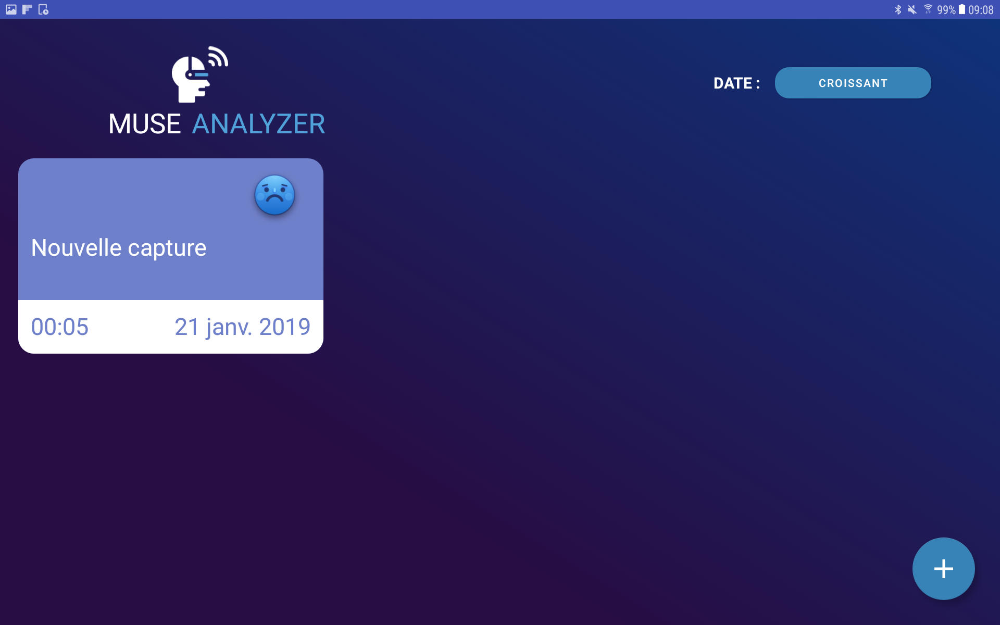
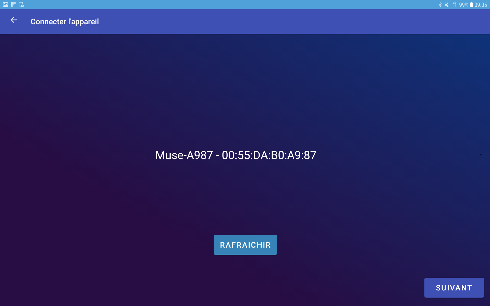
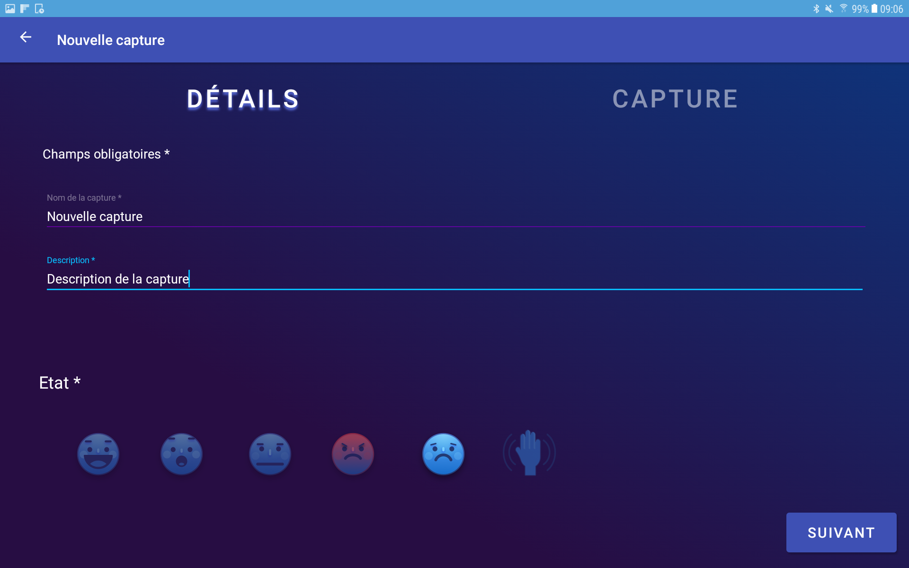
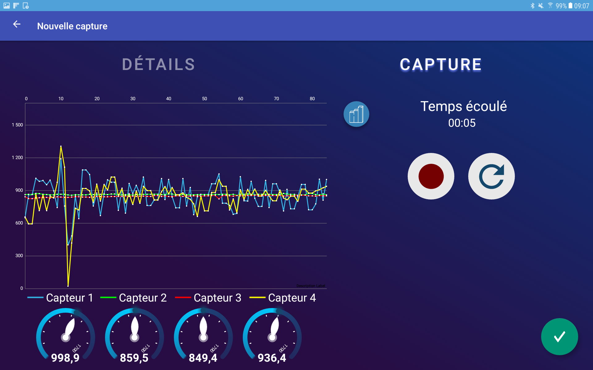
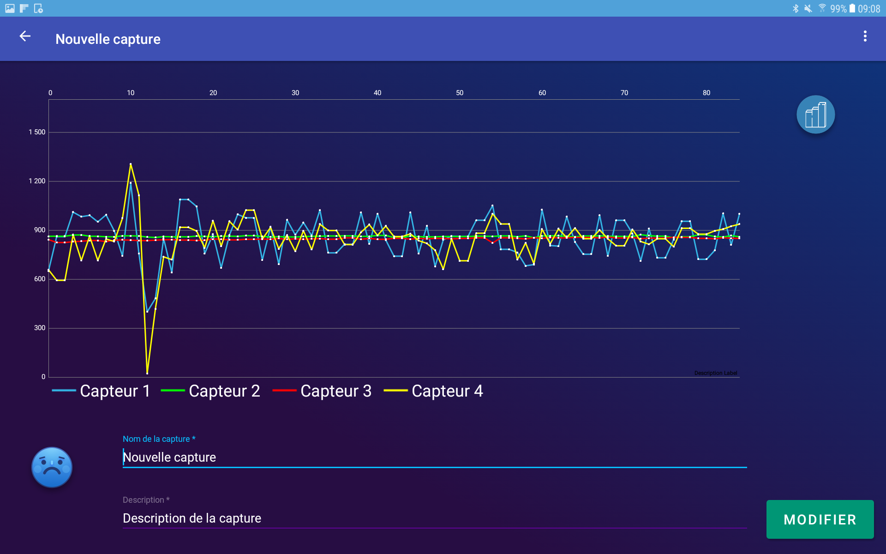

# Muse App Android
Cette application a été réalisé dans le cadre de l'IUT lors d'un projet tuteuré. Le but de l'application est d'afficher des captures de l'activité électrique du cerveau (captures réalisées grâce au casque Muse).

# Screenshots de l'application

 
 

# Fonctionnement de l'application

### Ecran d'acceuil
*screenshots 1*

Dans cet écran nous pouvons retrouver la liste de tous les captures que vous avez réalisé. Vous pouvez ajouter une capture en cliquant sur le bouton "+" en bas à droite de l'écran. Vous pouvez aussi retrouvé les details des anciennes capture en cliquant sur l'une de vos capture.

### Ecran de connexion de l'appareil
*screenshots 2*

Cet écran permet de connecter le casque Muse à l'application, allumer le casque puis cliquer sur le bouton "rafraichir" quand le nom du casque apparait sur l'écran vous pouvez pousuivre l'ajout de la capture en cliquant sur "Suivant"

### Ajout d'une capture
*screenshots 3 - 4*

La premiere vue permet d'ajouter des informations sur la capture que vous allez réaliser, lorsque vous aurez entrer les details vous pourrez passer à l'enrigistrement des données du casque, pour se faire vous devrer clique sur le bouton "enregistrer", c'est a ce moment que l'application enregistrer les données renvoyer par le casque, lorsque vous voulez arreter l'enregistrement il faut cliquer sur le bouton "Pause", a ce momentla vous pouvez recommencer un capture en cliquant sur le bouton "recommencer", reprend la capture en cours en cliquant sur le bouton "enregistrer" ou validez la capture en cliquant sur le bouton "valider".

### Details d'une capture enregistrer
*screenshots 5*

Dans cet écran vous pouvez retrouver la visualisation des données par le biais de trois graphiques, vous retrouvez aussi le titre et la description qui sont modifiable. Puis si vous cliquez sur le bouton "Plus d'option" vous pouvez exporter la capture au format CSV et vous pouvez supprimer la capture.

# Structure du projet
Le code est structuré de manière à bien différencier les couches de traitement des données et la présentation.

- data
  - manager : Traitement de la récupération des données et des fichiers JSON
  - repository : Appels de données nécessaires pour le manager
  - model : Classes modèles de l'application, contiennent les propriétés des objets de l'application
  
- presentation
  - presenter : Gestion des erreurs et appels aux méthodes get du repository
  - ui
    - activity : Activités de l'application, List et Detail, récupèrent les données ; implémentent leurs interfaces dans view
    - view : Interfaces des activités
    - adapter : Les classes "adapter" des listes des captures
    - viewholder : Les ViewHolder des adapater pour l'affichage des données dans le layout
